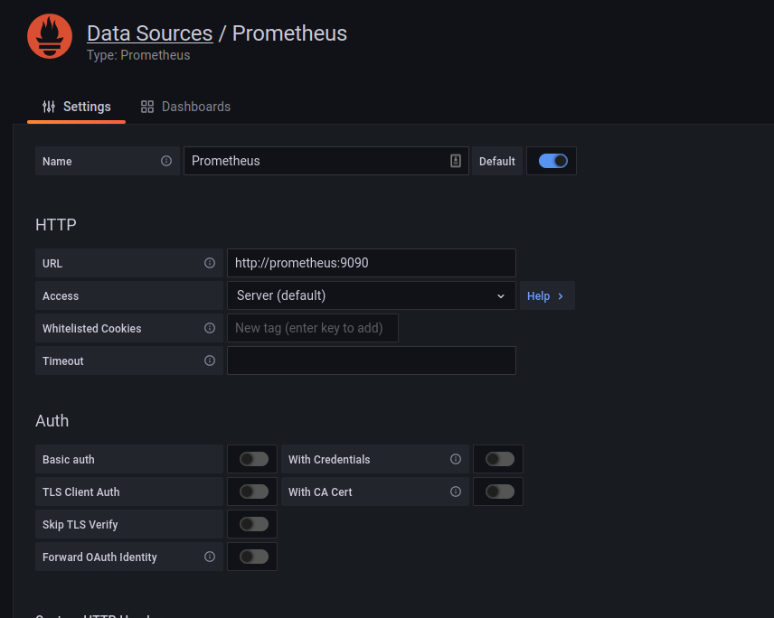

# Docker Test/Development Environment

I followed the setup steps from [here](https://grafana.com/grafana/dashboards/893)

## Setup
### Grafana
Setup your environment variables:
````
cd docker_env
cp grafana.env_sample grafana.env
````
update the `<PASSWORD>` entries with your chosen passwords.

## launch instructions

````
cd docker_env
docker-compose up -d
````

## Links

* [Prometheus homepage](http://localhost:9090)
* [Grafana homepage](http://localhost:3000)
  * grafana admin pasword is defined in your [docker_env/grafana.env file](../docker_env/grafana.env_sample)
## configuration

To link Prometheus and Grafana you need to create a Prometheus datasource in Grafana. Follow the steps [here](https://prometheus.io/docs/visualization/grafana/#creating-a-prometheus-data-source). Use `http://prometheus:9090` as the URL.
